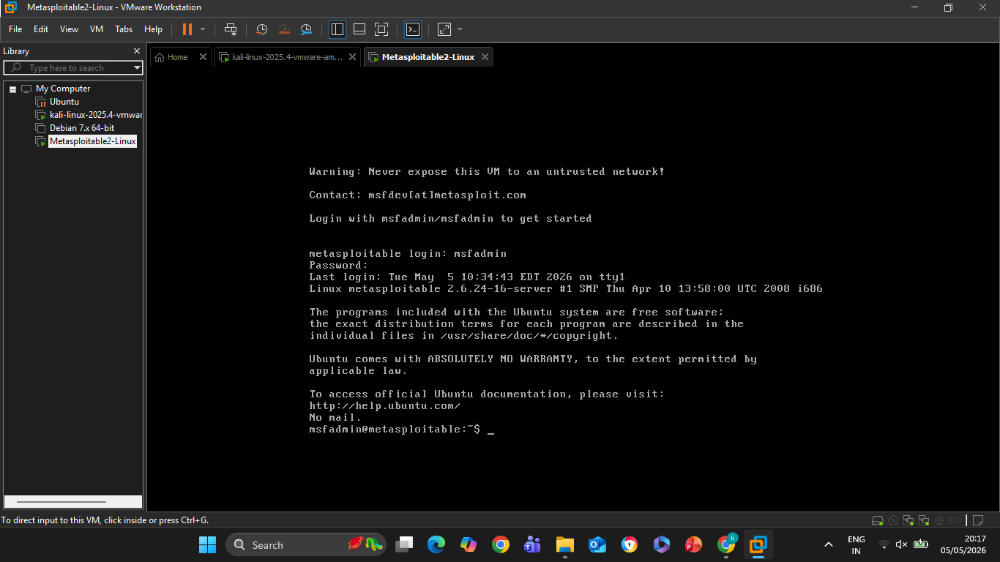
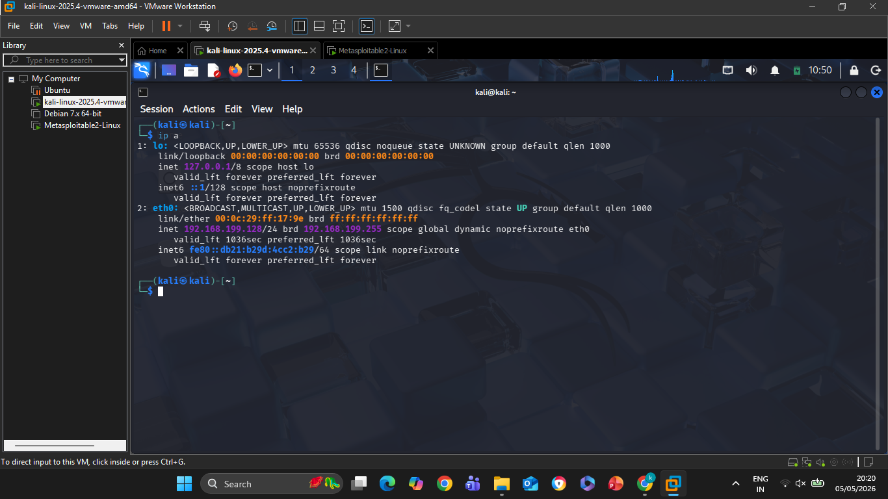
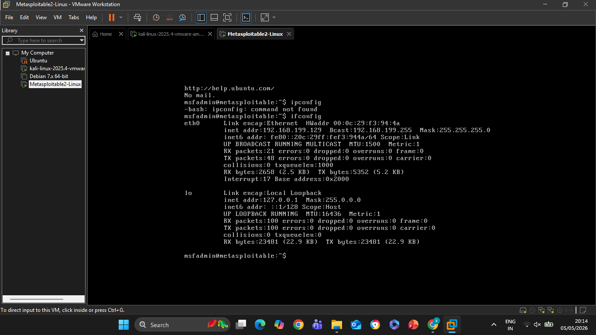
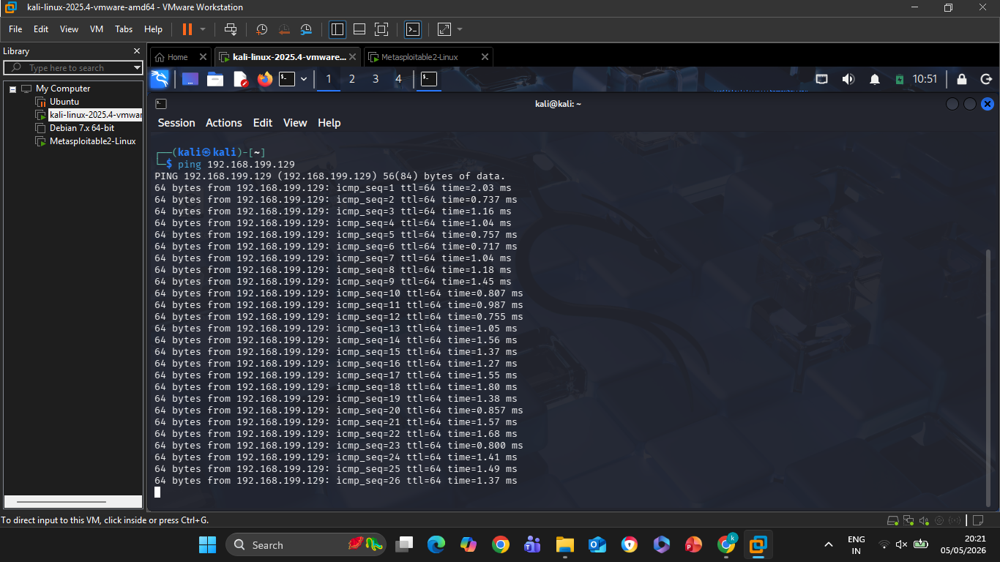
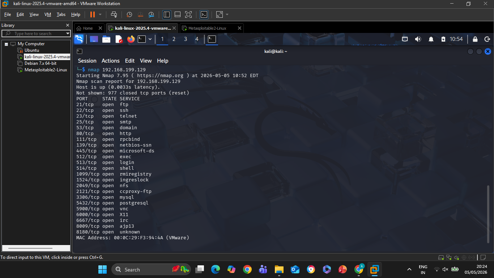

# NovaShyld Task-1

## 📌 Task: Foundations of Ethical Hacking & Penetration Testing

### 👩‍💻 Student Details:
- Name: Kalisetti Yogeswari
- Course: B.Tech CSE (Cyber Security)

---

## 🛠 Tools Used:
- Kali Linux
- Metasploitable2
- VMware Workstation

---

## 🔍 Tasks Performed:
- Setup virtual lab environment
- Practiced Linux commands
- Learned networking basics
- Tested connectivity using ping
- Performed Nmap scanning

---

## 📸 Screenshots

### Lab Setup

### Kali IP

### Target IP

### Ping Result

### Nmap Scan

---

## 📄 Report:
[Download Task-1 Report](./Task-1%20Ethical%20Hacking%20Report.pdf)

---

## 🎯 Outcome:
Successfully completed Task-1 and gained practical knowledge of ethical hacking and penetration testing.
